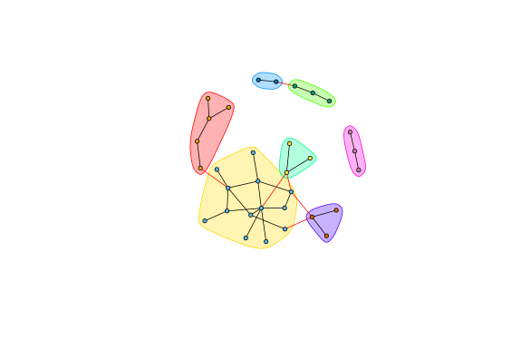
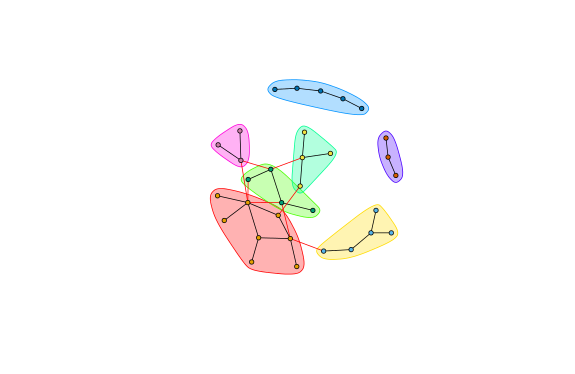

EX3: Network Analysis
=====================

Grey's Anatomy Network of Sexual Relations
------------------------------------------

**Centrality**
  1. Max Betweeness: Sloan(115.3667)
  2. Max Closeness: Torres(0.003194888)
  3. Max Eigenvector: Karev(1)

**Communities(Short Random Walks)**
  1. Modularity: 0.5147059
  2. Sizes: 5 13 3 3 2 3 3
  3.
  

**Communities(Girvan-Newman)**
  1. Modularity: 0.5774221
  2. Sizes: 8 5 4 4 5 3 3
  3.
  
