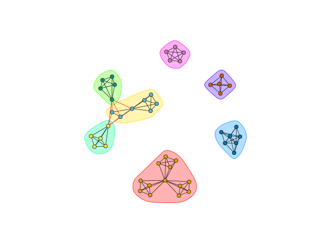
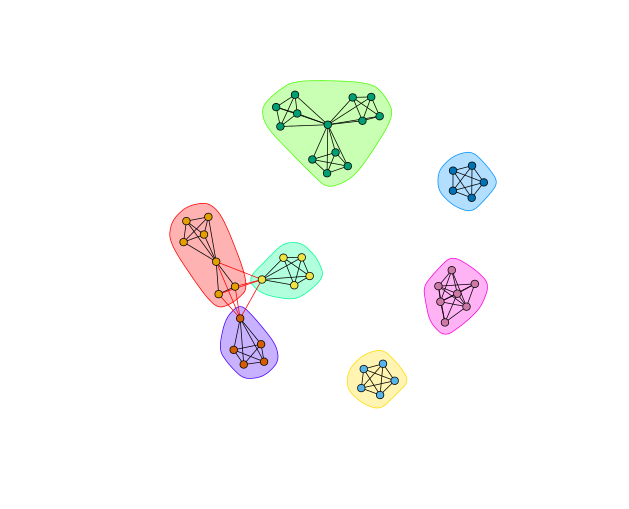

EX3: Network Analysis
=====================

Grey's Anatomy Network of Sexual Relations
------------------------------------------

**Centrality**
  1. Max Betweeness: Sloan(**115.3667**)
  2. Max Closeness: Torres(**0.003194888**)
  3. Max Eigenvector: Karev(**1**)

**Communities(Short Random Walks)**
  1. Modularity: 0.5147059
  2. Sizes: 5 13 3 3 2 3 3

**Communities(Girvan-Newman)**
  1. Modularity: 0.5774221
  2. Sizes: 8 5 4 4 5 3 3

  
IMDB Top Movies
---------------

**Centrality**
  1. Max Betweeness: Morgan Freeman, Christoph Waltz, Leonardo DiCaprio and Samuel L. Jackson(**48**)
  2. Max Closeness: Christoph Waltz, Leonardo DiCaprio, Samuel L. Jackson(**0.0006973501**)
  3. Max Eigenvector: Vin Diesel, Paul Walker, Michelle Rodriguez, Jordana Brewster(**1**)

**Communities(Short Random Walks)**
  1. Modularity: 0.765
  2. Sizes: 13 7 5 5 7 5 5

**Communities(Greedy Optimization)**
  1. Modularity: 0.765
  2. Sizes: 7 5 13 5 5 5 7

